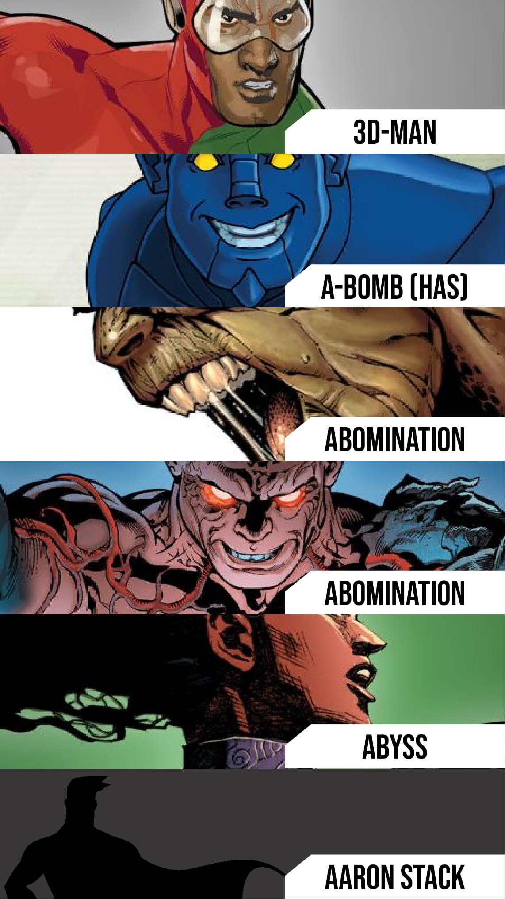
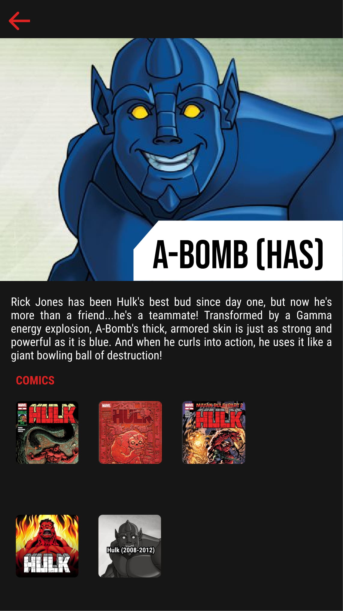

# **Marvel Heroes App**

*Android app to retrieve information from the [Marvel API](https://developer.marvel.com/) and displays a lot of details from every character of the **Marvel** world in a beautiful and easy way.*

## Wiremocks

`Splash`, `List` and `Details` view.

## Architecture

We will be using the **Architecture Components** approach of the [Android Jetpack](https://developer.android.com/jetpack/) libraries. This means extensive use of the **MVVM** pattern and **reactive programming**. The controller interfaces will be implemented in `ViewModel` classes, views will be represented for their respective `Fragments` and models will be wrapped inside `LiveData` objects. LiveData and ViewModels classes are **lifecycle-aware** and they allow the use of **Observer** pattern to handle the app state.  As a plus, these LiveData objects are **thread-safe** and we can exploit this capacity to create **asynchronous requests** to the API to improve performance. With this architecture, our code gains clearness and separation of concerns (with the help of `dependency inversion`) so this facilitates the usage of **TDD**.

For data `persistence` we are going to use the `Room` library due to its simplicity and robustness with the `Object Relational Mapping`. This library works very well with ViewModels and LiveData classes and creates an abstraction layer on top of **SQL** operations by using `annotations`.

To get an effective decoupling of the views, the **Data Binding** and **View Binding** libraries are helpful. With this, the views have the `single responsibility` of displaying information whilst the rest of the data handling resides in the ViewModel classes.

In the UI, we will be using **Material Desing** components mostly. For the list of characters we select the RecyclerView as is more effective than ListView or similars. Whilst in the Details view, we 

## Tasks

- [ ] Setting main views/navigation/layouts.
- [ ] Setting main models/controllers/interfaces.
- [ ] Setup API client.
- [ ] Request the list of characters.
- [ ] Request character details.
- [ ] Parsing response and display the list of character with RecyclerView.
- [ ] Parsing response and display character details.
- [ ] Adding coroutines to create async requests.
- [ ] Adding persistence.
- [ ] Adding tests. **

** Tests will be created upfront using TDD for the **business logic** as much as possible.

## *Extras*

- [ ] Dependency Injection with **Hilt**.
- [ ] Animations with **Motion Layout**.
- [ ] Day/Night mode.
- [ ] Predominant color detector for Details view using **Palette** component
